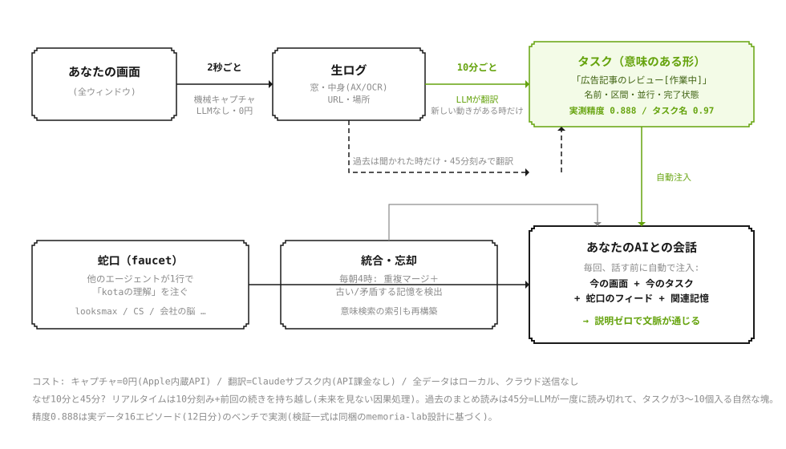

# memoria kota ver 2

**画面から「あなたが実際にやったこと」を覚えて、AIエージェントに「今なんのタスクか」を翻訳して渡すローカルのメモリ層。**
会話メモリ（本人が話したことしか覚えられない）と違い、行動そのものから記憶を作る。

<p align="center">
  
</p>

## 仕組みを5行で

1. **見る（0円・LLMなし）** — 観測層が**2秒ごと**に画面を記録して生ログ（JSONL）を作る
2. **理解する（10分ごと）** — 新しい動きがあった時だけLLMが生ログを読み、「ブラウザを見てた」ではなく**「広告記事のレビュー[作業中]」**というタスクに翻訳（実測精度0.888・タスク名同定0.97）
3. **思い出させる** — 翻訳済みタスクが**毎会話の頭に自動注入**される。過去は聞かれた時だけ**45分刻み**で翻訳（=LLMが一度に読み切れて、タスクが3〜10個入る自然な塊）
4. **注がれる（蛇口）** — 他のエージェントが1行（`echo 理解 | node faucet/pour.mjs <名前>`）でユーザーの理解を注げる
5. **忘れる** — 毎朝4時に重複をマージし、古い/矛盾する記憶をLLMが検出して会話にフラグを流す
6. **覚える（人・締切・決定）** — 2の同じ呼び出しから「田中さん／締切7/31／口頭承認OK」のような**次にAIへ渡す価値がある具体名**も抜き、`state/facts.json` に生きている記憶として持つ（追加コスト0・同じ根拠グラウンディング）
7. **渡す** — ブラウザ拡張が ChatGPT / Claude / Gemini の送信直前に「この3件を渡します」と見せ、OKされた分だけ入力欄へ足す（`GET /handoff`）

コスト: キャプチャ0円 / 翻訳は`claude`CLI経由＝Claudeサブスク内（API課金なし）/ データは全部ローカル・クラウド送信なし。
意味検索はApple内蔵の埋め込みモデル（512次元・完全ローカル）: `node recall.mjs <質問>`。

## デモ（APIキー不要・30秒）

翻訳層の肝＝**根拠グラウンディング**を、LLMを呼ばずその場で体験できる。翻訳AIは根拠が薄いと周囲の文脈から尤もらしい属性を発明しがち（例: コーディングの合間に見た料理動画を「プログラミング学習動画」と誤ラベル）。それを出口で機械的に落とす様子を見せる。

```bash
node demo/grounding-demo.mjs
```

```
── 採用されたタスク（evidenceがログに実在）──
  ✓ GitHub PR #482 のflakyテスト修正
  ✓ 認証ミドルウェアのリファクタ
── 落とされた無根拠タスク（発明とみなして除去）──
  ✗ プログラミング学習用YouTube動画の視聴  [evidence-not-in-log, cover=0.00]
```

全タスクは**ログから一字一句コピーしたevidence**を持たねばならず、ログに実在しないタスクは発明とみなして自動的に落とす（単語フィルタではなく「紐付けの有無」で判定）。

## read API（読）— 外部アプリ/エージェントが理解を問い合わせる口

Screenpipe型のAPIに相当するが、**生フレーム/生OCRは出さない**。返すのは翻訳済みの「理解」だけ（タスク・文脈・意味検索）＝あなたの画面そのものでなく「何をしていたか」。`install.sh` が `127.0.0.1:4319` に常駐サービスとして立てる。

```bash
node server.mjs                       # 単発起動（既定 127.0.0.1:4319）
curl localhost:4319/tasks             # いま走行/注視中のタスク
curl "localhost:4319/recall?q=$(python3 -c 'import urllib.parse;print(urllib.parse.quote("先週のリサーチ"))')"
curl "localhost:4319/at?t=2026-09-01T19:16:00"   # その時刻に何をしていたか
curl localhost:4319/context           # 今の注入コンテキストをまとめてJSONで
```

| エンドポイント | 返すもの |
|---|---|
| `GET /health` | 稼働確認 |
| `GET /tasks` | いま走行/注視中のタスク |
| `GET /recall?q=&limit=` | 意味検索（言い換えでも当たる） |
| `GET /at?t=<ISO JST>` | 指定時刻に走っていたタスク |
| `GET /context` | 今のタスク＋画面の見出し（生OCRは除く）＋覚えたこと |
| `GET /facts?type=&q=` | 覚えたこと（person / deadline / decision / project）。`q`で絞り込み |
| `GET /handoff?q=` | AIへ渡す記憶カード（質問に関係するfacts＋タスク）。拡張の「渡す前の確認」パネルが読む |

**開示ダイヤル** `?disclosure=intent|context|full`（既定 `context`）: `intent`=名前と状態だけ / `context`=+goal/apps/期間 / `full`=+evidence（URL等を含む身内向け）。粒度を1本のダイヤルで絞れる＝A2Aの開示思想と一致。

認証は既定で無し（localhost束縛のみ）。`MEMORIA2_API_TOKEN` を設定すると `Authorization: Bearer <token>` 必須になる。外部公開は `MEMORIA2_API_HOST=0.0.0.0` を明示した時だけ。

## 覚えたこと（facts）と、AIの入力欄への引き渡し

**facts** はタスク翻訳と同じ1回のLLM呼び出しに相乗りして抽出する（人・締切・決定・案件の4種だけ）。全factは evidence（ログから一字一句コピーした実在断片）を持ち、ログに無い人名・日付は `parser/grounding.mjs` が発明とみなして落とす。締切は `parser/facts.mjs` がISO日付へ揃え（「7/31」→基準日に近い年で補う）、日付に落ちないものは覚えない。生きている記憶は `state/facts.json`（同一は回数を更新、過ぎて30日の締切は忘れる）、履歴は `tasks/facts.jsonl`。注入メモ `tasks/current-tasks.md` にも「覚えたこと」節として出る。

**引き渡し**（`extension/shared/handoff.js`）は、ChatGPT / Claude Web / Gemini で Enter か送信ボタンを押した瞬間に一度だけ止め、background 経由で `127.0.0.1:4319/handoff?q=<下書き>` を引き、パネルで「この3件を渡します」と見せる。OKされたカードだけを入力欄の末尾へ `[memoria] 関係する記憶` ブロックとして足し、元の送信を1回だけ再現する。渡すのは翻訳済みの理解（factの一行とタスク名）だけで、生画面・URL・evidenceは渡さない。モードは provider ごとに `ask`（既定）/ `auto`（「このAIには毎回OK」）/ `off`。read API が落ちていても送信は止めない。入力欄の実機検証は `COMPOSER_PROFILES[*].verified` が示す（未検証＝セレクタは実測前）。

## MCPとLLM起動ガード

`mcp-server.mjs` は現行Kota v2のタスク・画面文脈・意味検索・覚えたこと（`get_facts` / `get_handoff`）をMCPとして公開し、明示メモと判断記録の保存にも対応する。旧Memoria SQLiteは参照しない。クライアントごとの許可scopeは `~/Library/Application Support/Memoria/mcp.json` で管理する。

```bash
node llm-connection.mjs status all    # Codex / Claude Code / Kimiの接続確認
node llm-connection.mjs connect all   # 許可済みprofileの登録を復旧し、実際にhealth probe
node llm-connection.mjs authorize all # 明示操作で全read/write scopeを許可して接続
```

`llm-launch-guard.zsh` を対話シェルから読み込むと、`codex` / `claude` / `kimi` / `herdr` の起動直前に接続を検査する。未接続ならmacOSの「Memoriaへ接続しますか？」ダイアログを出し、「はい」で許可済みprofileの登録だけを復旧・再検証し、「いいえ」またはEscなら接続せずLLMの起動を続行する。ポップアップからscopeを追加することはない。同時起動時はポップアップを1つにまとめる。無効化は `MEMORIA_CONNECTION_GUARD_DISABLE=1`。

## 使い方

```bash
git clone https://github.com/kota1020/memoria-kota2 ~/memoria-kota2
cd ~/memoria-kota2
export MEMORIA_SRC_LOG=~/path/to/activity-log.jsonl   # あなたの観測層の生ログ
./install.sh                                          # 常駐（launchd）として起動
./faucet/faucet.sh                                    # 注入内容の確認
```

### Chrome拡張の「思い出す」サイドパネル

`extension/chromium/` を Chrome の「拡張機能をパッケージ化」→「デベロッパーモード」→「パッケージ化されていない拡張機能を読み込む」で読み込むと、拡張アイコンから現在ページ用のMemoriaサイドパネルを開ける。パネルはページ本文を収集せず、タイトル・ドメイン・ユーザーが選択した文字だけを検索手がかりにして、ローカルの `/handoff` と `/context` を読む。最初の版は読み取り専用で、外部送信や自動注入は行わない。

**入力の契約**：生ログは1行1イベントのJSONL。`{"at":"<ISO時刻>","rows":[{"mon":"モニタ名","app":"アプリ","title":"窓タイトル","url":"...","idle":0,"ctx":"画面の中身テキスト"}]}`。
どんな観測手段でもこの形にすれば翻訳層はそのまま動く（作者はmacOSのCoreGraphics/アクセシビリティ/Vision OCRで2秒ごとに生成）。

**ユーザー固有の文脈**（働き方・よく使うツール等）は `config/profile.md` に書くと翻訳精度が上がる。configはgitignore対象＝あなたの情報がリポに入ることはない。

## 構成

- `daemon.mjs` — 常駐。10分ごとに新イベントを翻訳（動きなし/離席中はLLMを呼ばない）＋毎朝4時に統合パス
- `ondemand.mjs` — 過去区間を45分刻みで翻訳（`--hours 3` / `--yesterday` / JST範囲指定）
- `recall.mjs` — 意味検索。CLIとしても、read APIのライブラリ（`recall()`/`tasksAt()`）としても使える（`--rebuild`で索引再構築 / `--at "JST"`で時刻検索）
- `server.mjs` — read API（読）。外部アプリ/エージェントがタスク・文脈・意味検索を問い合わせる常駐サービス。開示ダイヤル付き
- `mcp-server.mjs` / `memoria-mcp` — Kota v2を各LLMへ渡すローカルstdio MCPサーバーと安定ランチャー
- `llm-connection.mjs` / `llm-launch-guard.zsh` — MCPの登録・実接続確認と、LLM起動直前の接続ポップアップ
- `consolidate.mjs` — 統合・忘却パス（重複マージ＋矛盾検出→蛇口注入）
- `faucet/` — 蛇口。pour.mjs（注ぎ口）と faucet.sh（会話への注入）
- `inject.sh` — 翻訳済みタスクのプロンプト注入（30分鮮度ゲート）
- `parser/` — rubric.md（タスク定義の正典・16エピソードのベンチで検証）/ render.mjs / interpret.mjs / grounding.mjs（無根拠タスク・factを落とす出口ガード）/ facts.mjs（人・締切・決定の正規化・統合・引き渡し候補）
- `demo/` — grounding-demo.mjs（APIキー不要でグラウンディングを体験）
- `search/` — Apple埋め込み（embed.swift）＋意味索引

環境変数: `MEMORIA_SRC_LOG`（生ログの場所）/ `MEMORIA2_MODEL`（モデル上書き）/ `MEMORIA2_INTERVAL_MS`

## License

[PolyForm Noncommercial 1.0.0](LICENSE) — 個人利用・学習・改変は自由。商用利用は要許可。by kota1020
